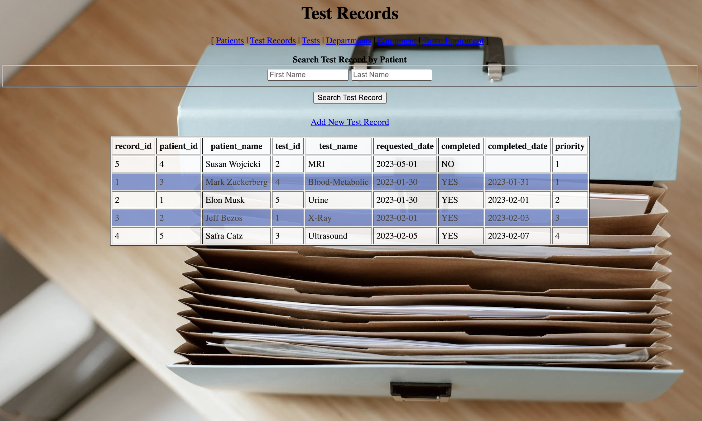

# Sunshine Medical

Welcome to the Sunshine Medical Application

## Table of Contents
- [Sunshine Medical](#sunshine-medical)
  - [Table of Contents](#table-of-contents)
  - [Overview](#overview)
  - [App File Structure](#app-file-structure)
  - [Features](#features)
  - [Screenshots](#screenshots)
  - [Technologies Used](#technologies-used)
  - [Operation](#operation)
  - [Attributions](#attributions)
## Overview
> [!CAUTION]
This deployed application connects to a production database to store data using the website provided in the resume. To ensure your privacy, kindly refrain from entering any  personal/sensitive information.

This project addresses the needs of a ficitious hospital name "Sunshine Medical". Hosptial management identified a delay in care as evidenced by a growing patient backlog. The medical database is intented to remediate patient tracking and equipment scheduling inefficiencies to improve operational capacity.

## App File Structure
The following is a brief overview of the file structure

[./Database_Documentation](https://github.com/voyagerfan/Sunshine-Medical/blob/main/Database_Documenation.pdf) - Detailed documenation for Database users/admins.

[./main.py](https://github.com/voyagerfan/Sunshine-Medical/blob/main/main.py) - Query execution and route handler for GCP version of deployment

[./static](https://github.com/voyagerfan/Sunshine-Medical/tree/main/static) - All CSS files for pages.

[./templates](https://github.com/voyagerfan/Sunshine-Medical/tree/main/templates) - All jinja pages

[./DDL.SQL](https://github.com/voyagerfan/Sunshine-Medical/blob/main/DDL.SQL) - Data Definition Languge

[./DML.SQL](https://github.com/voyagerfan/Sunshine-Medical/blob/main/DML.SQL) - Data Manipulation Language

## Features

This web application includes the following features for clinicians to manage patients in a treatment setting. 
* Patients screen - A table for entering or modifying patient information.
* Test Records Screen - The ability to display, search and add test records.
* Tests Screen - Displays all available tests that Sunshine Medical provides. Tests may be added, edited and removed to provide flexibility in department capabilities.
* Tests Equipment Screen - Displays all test equipment. The equipment may be added and removed as department assets are acquired/retired
* Equipment Screen - Manages the use of all equipment. Clinicians and authorized maintenance staff can update equipment availbility and critical maintenance data to ensure equipment is in specification before use.

## Screenshots

Patients Screen (Home screen)

Test Records Screen

Tests Screen

Test Equipment

Equipment

## Technologies Used

- **Web Development:** Python, Flask 
- **Front End Technologies:** Javascript, HTML, CSS
- **Database:** AWS RDS
- **Cloud Platform:** Google Cloud App Engine

## Operation

You may access the database using the URL listed on the resume. Feel free to explore the application by adding, modifying and deleting database entries. 

## Attributions
Ryan Kim - Project Partner

